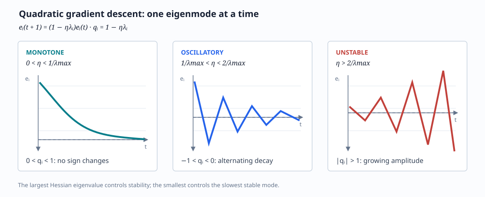

This is the first notebook of the notes I wrote for the course "Introduction to the Theory of Neural Networks" at SISSA in 2024. Course page: https://datascience.sissa.it/taught-phd-modules
# Quadratic Optimization and Gradient Descent

## Linear regression as a quadratic problem

Consider a linear predictor

$$
\hat y_\theta(x^\mu)=w^\top \phi_\theta(x^\mu),
$$

with feature/design matrix $\Phi$. The empirical square loss is

$$
\mathcal L(\theta)
=\frac1n\sum_{\mu=1}^n
\left(y^\mu-\hat y_\theta(x^\mu)\right)^2,
$$

while the test or population loss is

$$
\varepsilon_g(\theta)
=\mathbb E_{(x,y)}
\left[(y-\hat y_\theta(x))^2\right].
$$

For fixed features, the training objective is a quadratic function of the
weights:

$$
\mathcal L(w)=\frac12 w^\top A w+b^\top w+c.
$$

In the notebook's convention,

$$
A=\frac1n\Phi\Phi^\top,
\qquad
b\propto-\Phi y.
$$

$A$ is the empirical feature covariance or Hessian, and $b$ contains the
feature-label cross-correlation. The gradient and stationary point are

$$
\nabla_w\mathcal L(w)=Aw+b,
\qquad
w^\star=-A^{-1}b,
$$

when $A$ is invertible.

## Gradient descent in the eigenbasis

With step size $\eta$,

$$
w^{t+1}=w^t-\eta(Aw^t+b)
       =(I-\eta A)w^t-\eta b.
$$

Diagonalize the symmetric Hessian:

$$
A=V\Lambda V^\top,\qquad
\Lambda=\operatorname{diag}(\lambda_1,\ldots,\lambda_d).
$$

Writing $\bar w=V^\top w$ and $\bar b=V^\top b$, every eigendirection
evolves independently:

$$
\bar w_i^{t+1}
=(1-\eta\lambda_i)\bar w_i^t-\eta\bar b_i.
$$

For $\lambda_i>0$,

$$
\bar w_i^\star=-\frac{\bar b_i}{\lambda_i},
\qquad
\bar w_i^t-\bar w_i^\star
=(1-\eta\lambda_i)^t
(\bar w_i^0-\bar w_i^\star).
$$

This is a scalar geometric recursion in every spectral direction.

### Null directions

If $\lambda_i=0$:

- $\bar b_i=0$: the loss is flat and the corresponding component of $w$
  is unchanged.
- $\bar b_i\ne0$: the quadratic is not bounded below in that direction, and
  the weight drifts without a finite minimizer.

For a positive-semidefinite least-squares objective, consistency requires
$\bar b_i=0$ on the null space.

## Learning-rate regimes

Convergence along direction $i$ requires

$$
|1-\eta\lambda_i|<1
\quad\Longleftrightarrow\quad
0<\eta\lambda_i<2.
$$

Hence a sufficient global condition is

$$
0<\eta<\frac{2}{\lambda_{\max}}.
$$

- $0<\eta\lambda_i<1$: monotone approach to the optimum.
- $1<\eta\lambda_i<2$: alternating/oscillatory but convergent approach.
- $\eta\lambda_i\ge2$: divergence.

## Loss along the trajectory

In the eigenbasis, positive-eigenvalue directions give

$$
\mathcal L(w)-\mathcal L(w^\star)
=\frac12\sum_{\lambda_j>0}
\lambda_j(\bar w_j-\bar w_j^\star)^2.
$$

Substituting the recursion,

$$
\mathcal L(w^t)-\mathcal L(w^\star)
=\frac12\sum_{\lambda_j>0}
\lambda_j(\bar w_j^0-\bar w_j^\star)^2
(1-\eta\lambda_j)^{2t}.
$$

For small $\eta\lambda_j$,

$$
(1-\eta\lambda_j)^{2t}
\simeq e^{-2\eta\lambda_j t}.
$$

The slowest asymptotic mode is therefore controlled by
$\lambda_{\min}^+$, the smallest nonzero eigenvalue:

$$
\mathcal L(w^t)-\mathcal L(w^\star)
\sim e^{-2\eta\lambda_{\min}^+t}.
$$

Taking the largest stable step $\eta=O(1/\lambda_{\max})$ gives a time scale

$$
\tau
\sim\frac{\lambda_{\max}}{\lambda_{\min}^+}
=\kappa(A),
$$

the condition number. Ill-conditioned directions are learned slowly even
though the objective is convex.

