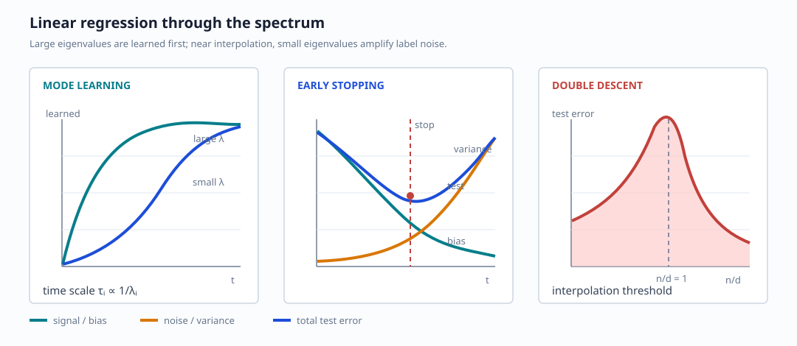

# Generalization Dynamics of Linear Models

## Teacher-student regression

For $n$ samples in $d$ dimensions, the empirical loss is

$$
\mathcal L(w)=\frac1n\|y-Xw\|_2^2,
$$

and the population error is

$$
\varepsilon_g(w)
=\mathbb E_{x,y}\left[(w^\top x-y)^2\right].
$$

The teacher-student model is

$$
x^\mu\sim\mathcal N(0,I_d),\qquad
y^\mu=\bar w^\top x^\mu+\varepsilon^\mu,\qquad
\varepsilon^\mu\sim\mathcal N(0,\sigma_\varepsilon^2).
$$

Because the input covariance is the identity,

$$
\varepsilon_g(w)
=\|w-\bar w\|_2^2+\sigma_\varepsilon^2.
$$

The two terms represent estimation error and irreducible measurement noise.

## Gradient-flow reduction

To study the high-dimensional limit, diagonalize the empirical covariance

$$
\frac1nX^\top X=V\Lambda V^\top.
$$

After moving to spectral coordinates $z=V^\top w$, the gradient-flow
equation separates:

$$
\tau\dot z_i(t)=\tilde s_i-\lambda_i z_i(t),
$$

where $\tilde s$ is the label-feature correlation in that basis. The exact
solution is

$$
z_i(t)=z_i(0)e^{-\lambda_i t/\tau}
       +\frac{\tilde s_i}{\lambda_i}
        \left(1-e^{-\lambda_i t/\tau}\right),
\qquad \lambda_i>0.
$$

Equivalently, relative to the teacher coordinate $\bar z_i$, the notebook
writes the estimation error as a decaying initialization term plus a
noise-fitting term proportional to

$$
\frac{\tilde\varepsilon_i}{\sqrt{\lambda_i}}
\left(1-e^{-\lambda_i t/\tau}\right).
$$

Plugging this into the population error gives the schematic decomposition

$$
\varepsilon_g(t)
=\frac1d\sum_i
\left[
C_{0,i}e^{-2\lambda_i t/\tau}
+\frac{\sigma_\varepsilon^2}{\lambda_i}
\left(1-e^{-\lambda_i t/\tau}\right)^2
\right]
+\sigma_\varepsilon^2.
$$

The first term forgets initialization. The second grows as the learner fits
label noise. Small eigenvalues are especially dangerous because of the factor
$1/\lambda_i$, although they are learned late.

## Spectral bias and early stopping

Large-$\lambda$ directions are learned first; small-$\lambda$ directions
are learned slowly. Therefore:

- early training captures well-supported directions;
- late training begins to fit weak directions dominated by noise;
- early stopping acts as a spectral regularizer.

Directions with $\lambda_i=0$ never receive a data-dependent update, so their
initialization can leave a permanent contribution to the test error.

## Wishart spectra

For an i.i.d. Gaussian design, $X^\top X/n$ is a Wishart matrix. In the
proportional limit $n,d\to\infty$ at fixed aspect ratio
$\alpha=n/d$, its empirical eigenvalue density converges to a
Marchenko-Pastur law:

$$
\rho_{\rm MP}(\lambda)
=\frac{\sqrt{(\lambda_+-\lambda)(\lambda-\lambda_-)}}
       {2\pi\alpha\lambda}
\mathbf 1_{\lambda\in[\lambda_-,\lambda_+]}
+(1-\alpha)_+\delta_0,
$$

with

$$
\lambda_\pm=(1\pm\sqrt\alpha)^2
$$

up to the normalization convention for $X$.

When $n<d$, a macroscopic null space appears. At $n=d$, the lower spectral
edge touches zero. When $n>d$, the empirical covariance is full rank with
high probability.

## Interpolation threshold and double descent

Near $n=d$, very small eigenvalues make the optimization slow and amplify
noise. The notebook sketches three regimes:

1. **Underparameterized in samples ($n<d$)**: a null space remains; training
   can interpolate while generalization retains initialization-dependent
   components.
2. **Overdetermined ($n>d$)**: no null space; the test error can dip and then
   increase as weak modes fit noise.
3. **Interpolation threshold ($n=d$)**: the spectral density reaches zero,
   producing the peak in the asymptotic error.

The resulting error as a function of $n/d$ is the double-descent profile.

