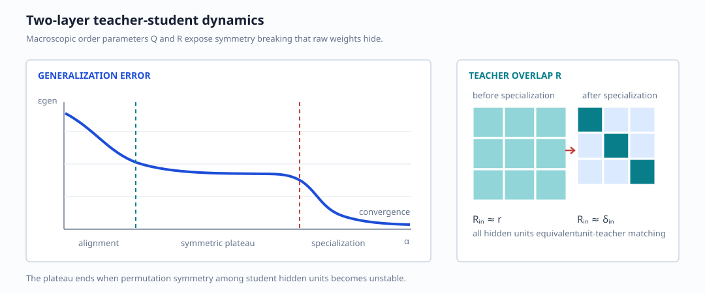

# Two-Layer Teacher-Student Dynamics

## Student and teacher

The student has $K=O(1)$ hidden units in $d$ dimensions:

$$
\hat y(x)=\sum_{k=1}^K v_k\,g(\lambda_k),
\qquad
\lambda_k=\frac{w_k^\top x}{\sqrt d}.
$$

The teacher has $M$ fixed hidden units:

$$
y(x)=\sum_{m=1}^M\bar v_m\,g(\bar\lambda_m),
\qquad
\bar\lambda_m=\frac{\bar w_m^\top x}{\sqrt d},
\qquad
x\sim\mathcal N(0,I_d).
$$

Online SGD receives a fresh teacher-labeled example at each step. For square
loss, the first-layer update has the form

$$
w_k^{\mu+1}
=w_k^\mu
-\eta d^{-1/2}
\left[
\sum_jv_jg(\lambda_j^\mu)
-\sum_m\bar v_mg(\bar\lambda_m^\mu)
\right]
v_k g'(\lambda_k^\mu)x^\mu.
$$

## Generalization error and local fields

The population error is

$$
\varepsilon_g
=\mathbb E_x\left[
\left(
\sum_kv_kg(\lambda_k)
-\sum_m\bar v_mg(\bar\lambda_m)
\right)^2
\right].
$$

For Gaussian inputs, the local fields
$(\lambda_1,\ldots,\lambda_K,\bar\lambda_1,\ldots,\bar\lambda_M)$
are jointly Gaussian. Their covariance is determined by three overlap
matrices:

$$
Q_{k\ell}=\frac1d w_k^\top w_\ell
\quad\text{(student-student)},
$$

$$
R_{km}=\frac1d w_k^\top\bar w_m
\quad\text{(student-teacher)},
$$

$$
T_{mn}=\frac1d\bar w_m^\top\bar w_n
\quad\text{(teacher-teacher)}.
$$

The joint covariance is

$$
C=
\begin{pmatrix}
Q&R\\
R^\top&T
\end{pmatrix}.
$$

Therefore $\varepsilon_g$ is a deterministic function of $Q,R,T$.
For $g(x)=\operatorname{erf}(x/\sqrt2)$, the needed Gaussian integrals have
closed forms.

## Macroscopic dynamics

Taking inner products of the microscopic SGD update with student and teacher
weights gives recursions for $Q$ and $R$. For example,

$$
R_{km}^{\mu+1}-R_{km}^{\mu}
=\frac{\eta}{d}g'(\lambda_k^\mu)
\left[
\sum_jv_jg(\lambda_j^\mu)
-\sum_n\bar v_ng(\bar\lambda_n^\mu)
\right]\bar\lambda_m^\mu,
$$

up to the sign convention chosen for the residual. Similar equations hold for
$Q_{k\ell}$, with both drift and $O(\eta^2)$ terms.

In large $d$, trajectories concentrate and these stochastic recursions close
as deterministic ODEs for the overlaps.

## Three learning phases

1. **Initial alignment.** The student-teacher overlaps start at
   $O(d^{-1/2})$. Permutation-symmetric configurations dominate.
2. **Plateau.** The network behaves approximately like a linear model. The
   students are similarly correlated with all teachers, and generalization
   improves slowly.
3. **Specialization/symmetry breaking.** Each student unit becomes correlated
   primarily with one teacher unit. The generalization error drops rapidly.

Schematically, before specialization the overlap matrix $R$ has nearly
uniform rows; after specialization it approaches a permuted diagonal matrix.
The teacher overlap $T$ has unit diagonal and $O(d^{-1/2})$ off-diagonal
entries for random teacher weights.

Specialization requires enough data or online updates to resolve the small
initial $O(d^{-1/2})$ differences between hidden units.

