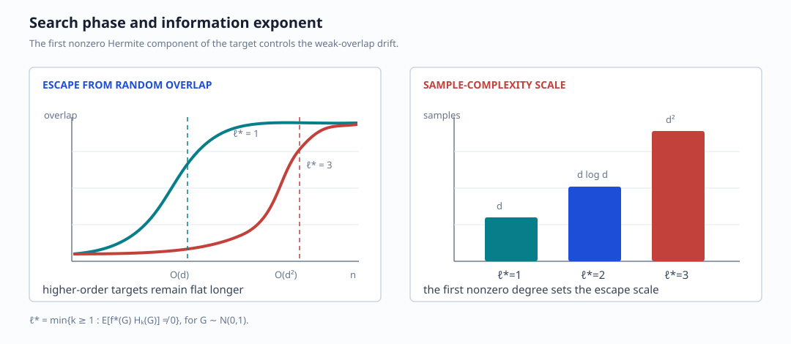

# Search Phase and Information Exponent

## From descent to search

The overlap dynamics may be summarized by

$$
\dot R(t)=-f_R(t),
\qquad
\dot Q(t)=f_Q(t),
$$

with initial conditions $R(0)=R_0$, $Q(0)=Q_0$. For random initialization,
the informative overlap is only $O(d^{-1/2})$. The early stage is therefore
a **search phase**: the learner must amplify a weak correlation with the
teacher before ordinary descent becomes effective.

## Spherical single-index model

The simplified setting uses

$$
\hat y=\sigma(w^\top x),
\qquad
y=\sigma(\bar w^\top x),
\qquad
x\sim\mathcal N(0,I_d),
$$

with $w,\bar w$ constrained to the unit sphere. A projected SGD step is

$$
w^{\mu+1}
=\frac{w^\mu-\eta v^\mu}
       {\|w^\mu-\eta v^\mu\|_2},
\qquad
v^\mu=\nabla_w\ell(w^\mu;x^\mu,y^\mu).
$$

Random initialization lies in an equatorial band of width $O(d^{-1/2})$
around directions orthogonal to $\bar w$. Define the overlap

$$
m^\mu=\langle w^\mu,\bar w\rangle.
$$

Expanding the normalization for small $\eta$,

$$
m^{\mu+1}
=m^\mu
-\eta\langle v^\mu,\bar w\rangle
-\frac{\eta^2}{2}\|v^\mu\|^2m^\mu
+O(\eta^3).
$$

The first correction is the informative drift. The second is a
normalization-induced decay term. Stochastic gradients also add noise.

Conditioning on the past $\mathcal F_\mu$ gives schematically

$$
\mathbb E[m^{\mu+1}\mid\mathcal F_\mu]
\simeq
m^\mu-\eta\,\mathbb E[\langle v^\mu,\bar w\rangle]
-\frac{\eta^2}{2}
\mathbb E[\|v^\mu\|^2]m^\mu.
$$

Learning requires the signal term to dominate the quadratic/noise penalty.
Optimizing the stable step size balances these two contributions.

## ReLU and cubic examples

The notebook contrasts:

$$
\sigma(x)=\operatorname{ReLU}(x)
\quad\Rightarrow\quad
\text{escape after about }d\text{ updates},
$$

and

$$
\sigma(x)=x^3-3x=H_3(x)
\quad\Rightarrow\quad
\text{escape after about }d^2\text{ updates}.
$$

The second activation has no degree-one or degree-two Gaussian component, so
the early drift aligned with the teacher is much weaker.

## Correlation loss and Hermite expansion

The correlation loss is

$$
\mathcal L(w)
=1-\mathbb E\left[
\sigma(w^\top x)\sigma(\bar w^\top x)
\right].
$$

Expand the activation in the orthonormal Hermite basis for a standard Gaussian:

$$
\sigma(z)=\sum_{k\ge0}a_kH_k(z).
$$

For unit vectors $w,\bar w$ with overlap $m=w^\top\bar w$,

$$
\mathbb E[
H_k(w^\top x)H_\ell(\bar w^\top x)]
=\delta_{k\ell}m^k.
$$

Thus

$$
\mathbb E[
\sigma(w^\top x)\sigma(\bar w^\top x)]
=\sum_{k\ge0}a_k^2m^k.
$$

Near random initialization $m=O(d^{-1/2})$, the first nonzero coefficient
dominates.

## Information exponent

Define

$$
\ell^\star=\min\{k\ge1:a_k\ne0\}.
$$

$\ell^\star$ measures the hardness of finding the teacher direction under
local gradient information. The scaling summarized in the notebook is:

$$
\begin{array}{c|c|c}
\ell^\star&\text{escape/search time}&\text{regime}\\\hline
1&O(d)&\text{linear}\\
2&O(d\log d)&\text{quasi-linear}\\
\ge3&O(d^{\ell^\star-1})&\text{polynomial}
\end{array}
$$

A first-order ODE approximation captures only the deterministic drift. The
search phase also depends on fluctuations, because the signal becomes visible
only when the overlap has grown beyond its $O(d^{-1/2})$ initialization.

