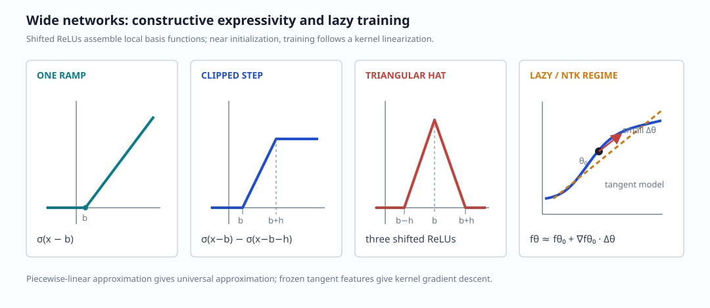

# Wide Networks, Kernels, and Random Features

## Wide two-layer networks

For fixed input dimension $d=O(1)$ and width $N\to\infty$, consider

$$
\Phi_\theta(x)
=\frac1N\sum_{k=1}^N
v_k\,\sigma(w_k^\top x+b_k).
$$

The regression setting is

$$
y_i=f(x_i)+z_i,\qquad
\mathbb E[z_i]=0,\qquad
\mathbb E[z_i^2]=\sigma_z^2,\qquad
\mathbb E[f(x)^2]<\infty.
$$

With a sigmoidal or other non-polynomial activation, finite sums of ridge
functions are dense in broad function classes: for every $\varepsilon>0$,
a sufficiently wide two-layer network can approximate the target in
$L^2(P_x)$ to accuracy $\varepsilon$.

### ReLU construction

Translated and rescaled ReLUs build piecewise-linear functions. Differences
of two ramps create a clipped step; combinations of steps create a triangular
hat. A sum of such local hats approximates continuous functions on compact
sets.

## Barron's theorem

Suppose the target has Fourier representation

$$
f(x)=\int_{\mathbb R^d}e^{i\omega^\top x}F(\omega)\,d\omega
$$

and $P_x$ has bounded support. A Fourier moment such as

$$
C_f\propto
\int_{\mathbb R^d}\|\omega\|_2\,|F(\omega)|\,d\omega
$$

controls its Barron complexity. Then there exists a width-$N$ two-layer
network $f_N$ satisfying

$$
\|f-f_N\|_{L^2(P_x)}
\le\frac{C_f}{\sqrt N}.
$$

Equivalently, reaching squared error $\varepsilon$ needs width on the order
of $C_f^2/\varepsilon$. The important point is that the rate is expressed in
terms of the target's spectral complexity rather than an explicit exponential
dependence on $d$.

## Kernel ridge regression

Let $\phi(x)$ be a possibly infinite-dimensional feature map and

$$
\hat y(x)=w^\top\phi(x).
$$

Ridge regression minimizes

$$
\mathcal L(w)
=\frac1{2n}\sum_{i=1}^n
(y_i-w^\top\phi(x_i))^2
+\frac\lambda2\|w\|^2.
$$

At the optimum, $w$ lies in the span of the training features:

$$
w=\Phi^\top a,
$$

where $\Phi$ is the feature matrix. With the Gram matrix

$$
K=\Phi\Phi^\top,\qquad
K_{ij}=k(x_i,x_j)=\phi(x_i)^\top\phi(x_j),
$$

the dual coefficients are

$$
a=(K+n\lambda I)^{-1}y
$$

under the $1/n$ loss convention. The prediction is

$$
\hat y(x)
=k(x)^\top(K+n\lambda I)^{-1}y
=\sum_{i=1}^n a_i\,k(x_i,x).
$$

Kernel regression is therefore linear regression in an implicit feature
space. The cost is dominated by building and solving with the $n\times n$
Gram matrix, typically $O(n^3)$, and the kernel itself is not learned from
the labels.

## Random Fourier features

For a shift-invariant positive-definite kernel
$k(x,y)=\kappa(x-y)$, Bochner's theorem gives

$$
\kappa(\delta)
=\int_{\mathbb R^d}
p(\omega)e^{i\omega^\top\delta}\,d\omega
=\int_{\mathbb R^d}
p(\omega)\cos(\omega^\top\delta)\,d\omega,
$$

where $p(\omega)$ is a nonnegative spectral measure. Sampling
$\omega_1,\ldots,\omega_N\sim p$ yields the Monte Carlo approximation

$$
k(x,y)
\approx\frac1N\sum_{j=1}^N
\cos(\omega_j^\top(x-y)).
$$

A real feature map can be written as

$$
z(x)=\sqrt{\frac2N}
\begin{bmatrix}
\cos(\omega_1^\top x+b_1)\\
\vdots\\
\cos(\omega_N^\top x+b_N)
\end{bmatrix},
\qquad
b_j\sim\operatorname{Unif}[0,2\pi],
$$

so that $z(x)^\top z(y)\approx k(x,y)$. The resulting model

$$
\hat y_{\rm RF}(x)=v^\top z(x)
$$

learns only $v$, replacing the exact Gram matrix by explicit
lower-dimensional random features.

## Neural tangent kernel and the lazy regime

For the $1/\sqrt N$ parameterization

$$
\Phi_{\rm NN}(x;\theta)
=\frac1{\sqrt N}\sum_{i=1}^N
v_i\sigma(w_i^\top x),
$$

expand around initialization
$\theta=\theta_0+\varepsilon\Delta\theta$:

$$
\Phi_{\rm NN}(x;\theta)
=\Phi_{\rm NN}(x;\theta_0)
+\varepsilon
\nabla_\theta\Phi_{\rm NN}(x;\theta_0)^\top
\Delta\theta
+O(\varepsilon^2).
$$

The tangent features include

$$
\frac{\partial\Phi}{\partial v_i}
=\frac1{\sqrt N}\sigma(w_i^0{}^\top x),
\qquad
\frac{\partial\Phi}{\partial w_i}
=\frac1{\sqrt N}v_i^0\sigma'(w_i^0{}^\top x)x.
$$

Their inner products define the neural tangent kernel. In the infinite-width,
small-movement regime, training is approximately linear in parameter
increments and the tangent kernel stays nearly constant. This is the **lazy
training** regime.

